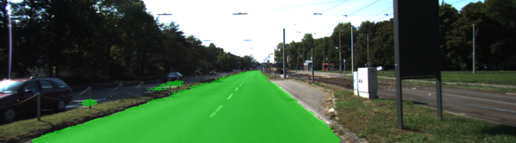
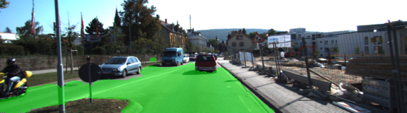
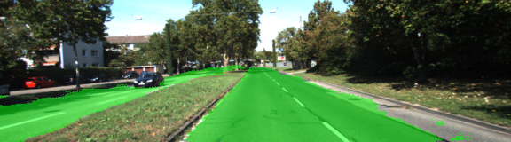
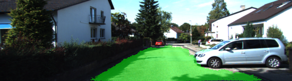

# Term 3 Elective: Semantic Segmentation project
## Introduction
In this project, i label the pixels of a road in images using a Fully Convolutional Network (FCN) according to the paper [here](https://people.eecs.berkeley.edu/~jonlong/long_shelhamer_fcn.pdf) developped at Berkeley.

## Project Overview
In this project, we labeled the pixels of a road in images using a Fully Convolutional Network (FCN) programmed in Python 3.5.2, Tensorflow 1.3.0, running in an Ubuntu 16.04 . I experimented with multiple epochs, batch sizes, learning rates and dropouts hyper parameters during training, and  finally settled on the following hyper parameters :

Epochs: 20
Batch Size: 1 (One 160x576 pixel RGB image)
Learning rate: 0.0001
Dropouts: 0.5
I saved the final model and resulting weights in the runs directory, where all of the latest inference images are also stored.

## Result
The final Loss: 0.011532140895724297

The predicting images can be seen in the directory "./runs/".
The following give examples of the output of this Fully Convolutional Network for Semantic Segmentation:
  

  

  

  

## Setup
### Frameworks and Packages
Make sure you have the following is installed:
 - [Python 3](https://www.python.org/)
 - [TensorFlow](https://www.tensorflow.org/)
 - [NumPy](http://www.numpy.org/)
 - [SciPy](https://www.scipy.org/)
### Dataset
Download the [Kitti Road dataset](http://www.cvlibs.net/datasets/kitti/eval_road.php) from [here](http://www.cvlibs.net/download.php?file=data_road.zip).  Extract the dataset in the `data` folder.  This will create the folder `data_road` with all the training a test images.

### Vgg16 pretrained model
  In this project ,we can build the FCN  from pretrained vgg16. The coresponding graph and parameters can be loaded from [here](https://s3-us-west-1.amazonaws.com/udacity-selfdrivingcar/vgg.zip)


## Run
Run the following command to run the project:
```
python main.py
```


